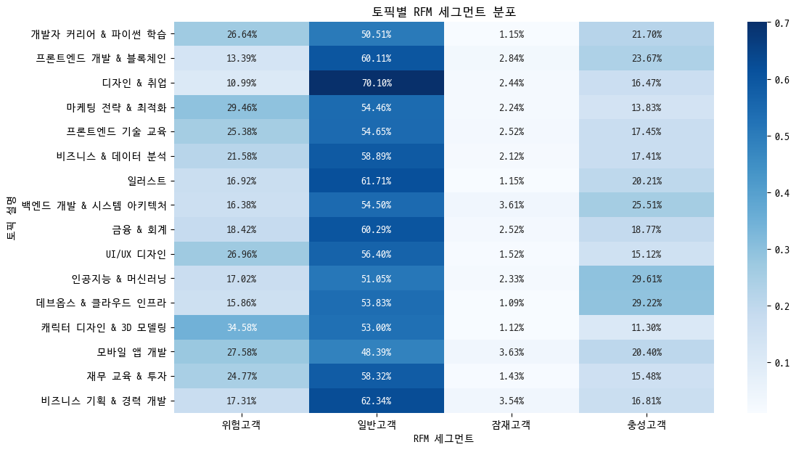

강의 주제별 수익 안정성 높이는 방안
==============

요약
--------------------------------------
1. 기본 정보
- 개인 프로젝트(기여도 100%)
- 기간 : 2024.04.24 ~ 2024.05.10
***
2. 프로젝트 진행 배경
- 키워드 데이터를 가지고 머신러닝을 활용하여 분석을 해 보고자 진행하였습니다.
- RFM분석을 공부하고 이를 내재화 하기 위하여 진행하였습니다.
- 로그 데이터셋을 가지고 분석을 진행해 보고자 실시하였습니다.
***

1. 데이터셋
- 패스트 캠퍼스 2022년도 실제 데이터(마스킹 처리가 된)입니다.
- CSV와 txt, xlsx로 다양한 파일 형태로 저장 되어있습니다.
  - 각 파일 확장자에 맞게 파일들을 불러와서 분석을 진행하였습니다.
- order 데이터셋으로 합치고 싶었지만, 조인하는 과정에서 course 데이터와 order 데이터를 조인하는 데 어려움이 있었습니다
  

***
### 1. 문제 정의

- 월별 판매 횟수를 그래프로 시각화해본 결과 시간이 지남에 따라 판매 횟수가
증가하는 것을 알 수 있습니다.

- 코호트 차트를 보면 고객의 유지율(=고객 재구매율)이 첫 구매 이후 한 달 이내
로 재구매하는 비율이 8~18%였고, 한 달 이후에 재구매하는 비율은 4~6%로 매
우 낮습니다. 이로 인해 월별 판매 횟수가 꾸준히 증가하는 것은 기존 고객의 구
매가 아니라 신규 유입되는 고객들의 증가로 인해 판매 횟수가 증가하는 것으로
판단됩니다.
- 고객의 유지율이 낮아 기업의 수익 안정성이 떨어진다는 문제를 야기합니다. 고
객 유지율을 높이는 마케팅 전략을 통해 고객 유지율을 높이면 해당 기업의 수
익은 더욱 증가하고 안정성 또한 증가하게 됩니다.

***
### 2. 문제 인식

- 고객들의 RFM 세그먼트 분포를 비교해 본 결과 VIP 고객은 한 명도 존재하지 않고 충성 고객보다 위험 고객의 비율이 더 많은 것을 알 수 있습니다.
- 코호트 차르를 보면 유입한 고객 중 재구매율이 15%도 안 되기 때문에 충성 고객의 비율이 위험 고객의 비율보다 작습니다.

-------

### 3. LDA modeling

- 강의 데이터의 컬럼에 쉼표로 여러 키워드들이 저장되어 있고 데이터 상의 모든
거래 중 98.7%의 거래가 키워드가 존재하는 강의 거래였습니다. 이를 가지고 키
워드를 가지고 모델을 적용해 카테고리 정리가 되어있지 않은 강의들을 강의 주
제 별로 카테고리화하여 분석을 이어나가는 방향을 선택하였습니다.
- 고객 유지율을 높이는 마케팅 방안을 강의 주제별 판매 데이터로 분석하여 찾은
마케팅 방안이 높은 성공률을 낼 거라 판단했습니다.
----- 
#### 1. 전처리 작업

- 한 컬럼에 여러 키워드가 존재하여 쉼표를 제거하고 띄어쓰기를 통해 단어를 쪼개어 텍스트를 토큰화하였습니다.
- 주어진 데이터는 5개의 파일(4개의 csv 파일, 1개의 txt 파일)로 이루어져 있었습
니다. 고객들의 판매 분석을 실시하기 위해 5개의 파일을 조인했습니다. 판매 데
이터와 강의 데이터를 서로 조인할 컬럼이 마땅치 않아 판매 데이터의 마스킹
된 제목과 금액, 주문 날짜를 가지고 조인을 실시하였습니다
-------
#### 2. 모델 적용 

- 몇 개의 토픽으로 나눌지 정하기 위해 실루엣 계수를 구하고 가장 높은 실루엣 계수를 가지고 모델을 적용하였습니다.
  - 실루엣 계수가 16일 때 코헤런스 점수가 제일 높았습니다.
- 모델 적용 후 나누어진 토픽별로 주요 키워드들을 보고 이들의 주제를 정하였습니다.
  

- 모델의 하이퍼 파라미터를 수정하며 모델의 성능을 높였습니다
  - radom state를 지정하지 않을 경우 실행할 때마다 결과가 다르게 나와 지정하였습니다.
  - iterations과 pass를 증가시켜 모델의 일관성을 증가 시켰습니다.
------ 

### 4. EDA
#### 1. 토픽별 거래 횟수

- 일러스트에 관련된 강의가 제일 많이 팔린 것을 확인할 수 있다.
- 가장 많이 팔린 강의와 가장 적게 팔린 강의 서로 3배 가까이 차이 나는 것을 확인할 수 있었습니다.
  - 이는 주력 토픽(인기 있는 토픽)과 비주력 토픽(인기가 없는)이 존재한다는 것을 파악했습니다.
  - 하지만 이는 입문 난이도나 취업 시장의 트랜드에 따른 결과일 수도 있다고 생각합니다.
----
#### 2. 토픽별 시간대별 판매 횟수

- 오후 1시에서 2시 사이에 제일 많은 거래가 이루어진 것을 확인할 수 있었습니다
  - 직장인들에게는 점심시간에 해당하는 시간대입니다. 
- 반대로 2시부터는 거래가 감소하는 것을 알 수 있는데 이는 업무시간의 시작으로 인한 감소로 보입니다.
----
#### 3. 토픽별 유저 RFM 세그먼트 비율

- 카테고리에 해당하는 고객별로 얼마나 최근에, 얼마나 자주, 얼마나 많은 금액을 지출했는지에 따라 각각 1~4로 사용자 등급을 나누는 RFM 기법을 통해 재구매율이 높은 충성고객들과 재구매율이 낮은 위험 고객들의 분포를 시각화하였습니다. ​

- 사용자 등급을 나누어 보니 모든 강의 주제에서 VIP에 해당하는 고가치 고객들은 존재하지 않는 문제점을 찾을 수 있었습니다.​

- 충성 고객들의 구매 패턴을 파악하고 이를 위험 고객 비율이 높은 강의 주제와 비교하여 재구매율을 높이는 방안을 찾는 분석 방향을 결정하였습니다
----

### 5. 가설 수립
1. 토픽별로 RFM 고객 비율이 다르고 위험 고객의 비율이 높은 토픽들의 위험 고객 비율을 낮추고 충성 고객들의 비율을 높이면 기업 수익 안정성이 증가하지 않을까?

  - 위험 고객의 비율이 높은 강의들이 충성 고객의 비율이 높은 강의들보다 거래 횟수가 대부분 낮은 것을 확인할 수 있었다.
    - 이는 위험 고객 비율이 높은 강의의 위험 고객 비율을 낮추고 충성 고객들의 비율을 높이면 매출은 더욱 증가할 것이고 안정성 또한 증가할 것으로 보인다.
---------
### 6. 분석
#### 1. 할인 금액 분포 비교

- 할인이 고객들의 재구매에 영향을 미칠지 살펴본 결과, 첫 구매 이후 할인을 받고 재구매를 하는 거래가 할인을 받지 않고 구매하는 거래보다 9% 더 많이 일어납니다. 이는 첫 구매 이후 제공받는 할인은 고객들의 재구매를 유도한다고 할 수 있습니다. ​

- 위험 고객들도 할인을 받아 재구매를 하는 경우가 있지만 대부분 10,000원의 할인을 받은 재구매를 한 경우입니다. 하지만 충성 고객들은 위험 고객들과 다르게 20,000~40,000의 할인 비율이 높아 평균 할인율이 높습니다. 

#### 2. 시간대별 판매 비교 

- 충성 고객들과 위험 고객 비율이 높은 카테고리를 시간대별로 비교했습니다. 대부분 공통적으로 점심시간에 해당하는 12시부터 14시까지 거래 횟수가 증가하고 이후 오후 일과 시간에 해당하는 14시 이후부터 16시까지 거래 횟수가 급격히 감소합니다.​

- 프론트엔드 기술 교육이라는 주제를 가진 강의들의 거래는 점심시간이 아닌 오전 6시에 가장 많은 거래가 이루어져 있습니다.​

- 충성 고객들의 경우 점심시간에는 다른 시간대보다 거래 횟수가 38%까지 증가합니다. 하지만 위험 고객 비율이 높은 일러스트 주제의 강의는 점심시간에 23% 증가하는데 이는 충성고객보다 15% 낮게 증가하는 추세를 보입니다. 
----------
### 6. 결론
- 현재 패스트 캠퍼스는 고객들의 재구매율이 8~18%로 매우 낮아 신규 고객들의 구매가 매출의 90%입니다. 현재 이런 상태는 수익 안정성이 매우 낮다고 판단됩니다. 기업의 수익 안정성을 높이기 위한 마케팅 방안이 필요합니다. ​

- 충성 고객들의 구매 패턴을 통해 점심 시간대에 거래가 이전 시간대에 비해 38% 더 많아 해당 시간대에 제일 활발하게 이루어지고 있습니다. 위험 고객 비율이 높은 강의 주제들을 비교해보면, 재구매를 할 때 충성 고객들이 할인을 받은 거래가 9% 더 많으며, 충성 고객들의 평균 할인율은 위험 고객 보다 4% 더 높으며, 20,000 이상의 할인을 받았을 때의 거래가 10% 더 많습니다.​

- 이러한 사실들을 기반으로 위험 고객 비율이 높은 '캐릭터 디자인 & 3D 모델링', '일러스트', '프론트엔드 기술 교육', 'UI/UX 디자인', '재무 교육 & 투자' 강의 주제들에 대해 다음과 같은 마케팅 방안을 제안드립니다.​

  - 1. 점심시간 집중 광고 : 점심시간대에 집중 기업의 광고에 노출되게 하고 오후 일과 시간에는 광고를 하지 않고 마케팅 비용을 절약하며 마케팅 효율을 늘리는 방안이 적절합니다. 특히 '일러스트' 주제와 '프론트엔드 기술 교육' 강의들은 점심시간에 거래가 다른 주제들보다 활발하지 않아 점심시간을 집중 공략하여 거래 횟수를 늘릴 수 있습니다.​

  - 2. 기존 보다 많고 높은 금액의 할인 제공 : 할인 쿠폰 혹은 특정 기간 할인 같은 할인 마케팅을 기존의 할인 금액보다 많이 제공하여 신규 고객이나 기존 고객들의 재구매를 유도하여 충성 고객들을 늘리는 방안이 적절해 보입니다.​
이러한 방법들은 비용이 투자되는 방안들이지만 이로 인해 충성 고객들이 많아지게 된다면 투자한 비용과 현재 매출보다 더 많은 매출을 가질 수 있을 것입니다.

-----
