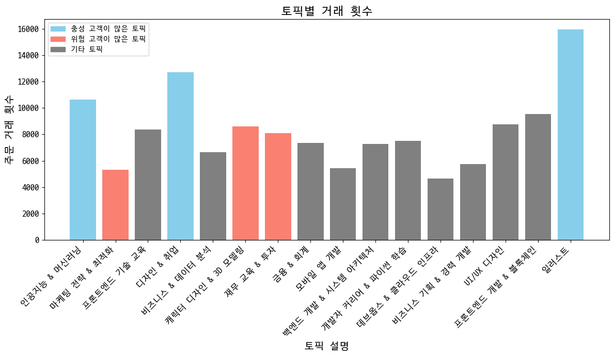

퇴사 요인 분석
==============

요약
--------------------------------------
1. 기본 정보
- 개인 프로젝트(기여도 100%)
- 기간 : 2024.04.24 ~ 2024.05.10
***
2. 프로젝트 진행 배경
- 키워드 데이터를 가지고 머신러닝을 활용하여 분석을 실시해보고자 진행하였습니다.
- RFM분석을 공부하고 이를 내재화 하기 위하여 진행 하였습니다.
- 로그 데이터셋을 가지고 분석을 진행해보고자 실시하였습니다.
***

1. 데이터셋
- 패스트 캠퍼스 2022년도 실제 데이터(마스킹 처리가 된)입니다.
- csv와 txt, xlsx로 다양한 파일 형태로 저장 되어있습니다.
  - 각 파일 확장자에 맞게 파일들을 불러와서 분석을 진행하였습니다.
- order 데이터셋으로 합치고 싶었지만 조인하는 과정에서 course 데이터와 order 데이터를 조인하는데 어려움이 있었습니다
  

***
### 1. 문제 정의
- 해당 기업의 고객들의 유입은 많지만 유입한 고객들 대비 재구매율이 낮아 고가치 고객(VIP)가 존재하지 않습니다.
- 탄탄한 고객층이 존재하지 않기 때문에 탄탄한 고객층을 만들어 기업의 안정성을 증가시킬 필요가 있다고 판단되어 분석을 진행하게 되었습니다.

***
### 2. 문제 인식

- 고객들의 RFM 세그먼트 분포를 비교해본 결과 VIP고객은 한 명도 존재하지 않고 충성 고객보다 위험 고객의 비율이 더 많은 것을 알 수 있습니다.
- 코호트 차르를 보면 유입한 고객들 중 재구매율이 15%도 안되기 때문에 충성 고객의 비율이 위험 고객의 비율보다 작습니다.

-------

### 3. LDA modeling

- 전체 거래중 98.7%가 키워드가 존재하는 거래입니다.
  - 이를 보고 키워드를 가지고 분석을 진행하면 좋겠다는 생각이 들었습니다.
  - 키워드를 통해 연관성 분석, 클러스터링 분석, LDA모델을 통한 분석을 고민하였습니다
- 하지만 판매된 강의들의 카테고리가 존재하지 않아 카테고리를 분류하여 분석을 진행하기 위해 LDA 모델링을 적용했습니다.
----- 
#### 1. 전처리 작업
- 한 컬럼에 여러 키워드들이 존재하여 쉼표를 제거하고 띄어쓰기를 통해 단어를 쪼개어 텍스트를 토큰화 하였습니다.
- order 데이터셋에 course_id 컬럼이 존재하지 않아 고객이 구매한 강의의 이름과 날짜, 가격을 가지고 조인 조건을 추가하여 조인하였습니다.
-------
#### 2. 모델 적용 

- 몇 개의 토픽으로 나눌지 정하기 위해 실루엣 계수를 구하고 가장 높은 실루엣 계수를 가지고 모델을 적용하였습니다.
  - 실루엣 계수가 16일때 코헤런스 점수가 제일 높았습니다.
- 모델 적용 후 나누어진 토픽별로 주요 키워드들을 보고 이들의 주제를 정하였습니다.
- 모델의 하이퍼 파라미터를 지정하여 모델의 성능을 높였습니다
  - radom state를 지정하지 않을 경우 실행할 때마다 결과가 다르게 나와 지정하였습니다.
  - iterations과 pass를 증가시켜 모델의 일관성을 증가 시켰습니다.
------ 

### 4. EDA
#### 1. 토픽별 거래 횟수

- 일러스트에 관련된 강의가 제일 많이 팔린 것을 확인할 수 있다.
- 가장 많이 팔린 강의와 가장 적게 팔린 강의 서로 3배 가까이 차이나는 것을 확인할 수 있었습니다.
  - 이는 주력 토픽(인기있는 토픽)과 비주력 토픽(인기가 없는)이 존재한다는 것을 파악했습니다.
  - 하지만 이는 입문 난이도나 취업 시장의 트랜드에 따른 결과일수도 있다고 생각합니다.
----
#### 2. 토픽별 시간대별 판매 횟수

- 오후 1시에서 2시 사이에 제일 많은 거래가 이루어진 것을 확인할 수 있었습니다
  - 직장인들에게는 점심시간에 해당하는 시간대입니다. 
- 반대로 2시부터는 거래가 감소하는 것을 알 수 있는데 이는 업무시간의 시작으로 인한 감소로 보입니다.
----
#### 3. 토픽별 유저 RFM 세그먼트 비율

- 위험 고객 비율이 높은 토픽들 : '캐릭터 디자인 & 3D 모델링', '마케팅 전략 & 최적화', '모바일 앱 개발', 'UI/UX 디자인','개발자 커리어 & 파이썬 학습'
  - 이 토픽들의 경우 위험 고객의 비율이 25%가 넘는 것을 알 수 있습니다
  - 해당 토픽들은 시간이 지남에 따라 판매량이 감소하게 될 것으로 보입니다.
- 충성 고객 비율이 높은 토픽들 : '인공지능 & 머신러닝', '데브옵스 & 클라우드 인프라', '백엔드 개발 & 시스템 아키텍처','프론트엔드 개발 & 블록체인', '개발자 커리어 & 파이썬 학습'
  - 이 토픽들의 경우 충성 고객의 비율이 21%가 넘는 상위 5개의 토픽들 입니다.
  - 해당 토픽들은 시간이 지나도 충성 고객의 비율이 다른 토픽들보다 높아 안정성이 어느정도 보장된다고 보입니다.
----

### 5. 가설 수립
1. 토픽별로 RFM 고객 비율이 다르고 위험 고객의 비율이 높은 토픽들의 위험 고객 비율을 낮추고 충성 고객들의 비율을 높이면 기업 수익 안정성이 증가하지 않을까?

  - 위험 고객의 비율이 높은 강의들이 충성 고객의 비율이 높은 강의들보다 거래횟수가 대부분 낮은 것을 확인할 수 있었다.
    - 이는 위험 고객 비율이 높은 강의들의 위험 고객 비율을 낮추고 충성 고객들의 비율을 높이면 매출은 더욱 증가할 것이고 안정성 또한 증가할 것으로 보인다.
---------
### 6. 분석
#### 1. 할인율 비교

#### 2. 요일별 판매 비교

#### 3. 시간대별 판매 비교 

----------

### 6. 결론
- 
-----
