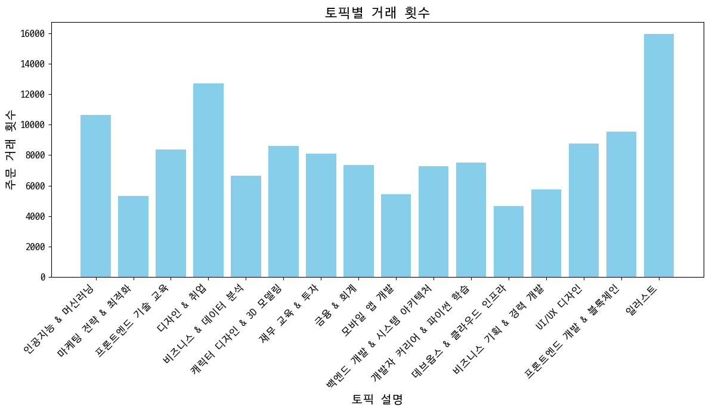

퇴사 요인 분석
==============

요약
--------------------------------------
1. 기본 정보
- 개인 프로젝트(기여도 100%)
- 기간 : 2024.04.24 ~ 2024.05.10
***
2. 프로젝트 진행 배경
- 키워드 데이터를 가지고 머신러닝을 활용하여 분석을 실시해보고자 진행하였습니다.
- RFM분석을 공부하고 이를 내재화 하기 위하여 진행 하였습니다.
- 로그 데이터셋을 가지고 분석을 진행해보고자 실시하였습니다.
***

1. 데이터셋
- 패스트 캠퍼스 2022년도 실제 데이터(마스킹 처리가 된)입니다.
- csv와 txt, xlsx로 다양한 파일 형태로 저장 되어있습니다.
  - 각 파일 확장자에 맞게 파일들을 불러와서 분석을 진행하였습니다.

***
### 1. 문제 정의
- 해당 기업의 고객들의 유입은 많지만 유입한 고객들 대비 재구매율이 낮아 고가치 고객(VIP)가 존재하지 않습니다.
- 탄탄한 고객층이 존재하지 않기 때문에 탄탄한 고객층을 만들어 기업의 안정성을 증가시킬 필요가 있다고 판단되어 분석을 진행하게 되었습니다.

***
### 2. 문제 인식

- 고객들의 RFM 세그먼트 분포를 비교해본 결과 VIP고객은 한 명도 존재하지 않고 충성 고객보다 위험 고객의 비율이 더 많은 것을 알 수 있습니다.
- 코호트 차르를 보면 유입한 고객들 중 재구매율이 15%도 안되기 때문에 충성 고객의 비율이 위험 고객의 비율보다 작습니다.

-------

### 3. LDA modeling

- 대부분의 거래가 키워드가 존재하는 거래입니다.
- 하지만 판매된 강의들의 카테고리가 존재하지 않아 카테고리를 분류하여 분석을 진행하기 위해 LDA 모델링을 적용했습니다.
----- 
#### 1. 전처리
- 한 컬럼에 여러 키워드들이 존재하여 쉼표 제거 후 pivot 테이블로 변환하는 전처리 작업하였습니다
- 몇 개의 토픽으로 나눌지 정하기 위해 실루엣 계수를 구하고 가장 높은 실루엣 계수를 가지고 모델을 적용하였습니다.

-------
#### 2. 모델 적용 
- 모델 적용 후 나누어진 토픽별로 주요 키워드들을 보고 이들의 주제를 정하였습니다.
------ 

### 4. EDA
#### 1. 토픽별 거래 횟수

- 일러스트에 관련된 강의가 제일 많이 팔린 것을 확인 할 수 있다.
----

----
#### 3. 토픽별 시간대별 판매 횟수

- 오후 1시에서 2시 사이에 제일 많은 거래가 이루어진 것을 확인할 수 있었습니다
  - 직장인들에게는 점심시간에 해당하는 시간대입니다.
  - 취준생에게는 오전 일과 후 오후 공부 및 취업 준비를 시작하는 시간대입니다.
----
#### 4. 토픽별 강의 가격 분포

----
#### 5. 토픽별 유저 RFM 세그먼트 비율
----

### 4. 가설 수립
1. 
---------
### 4. 분석

1. 

----------

### 6. 결론
- 
-----
